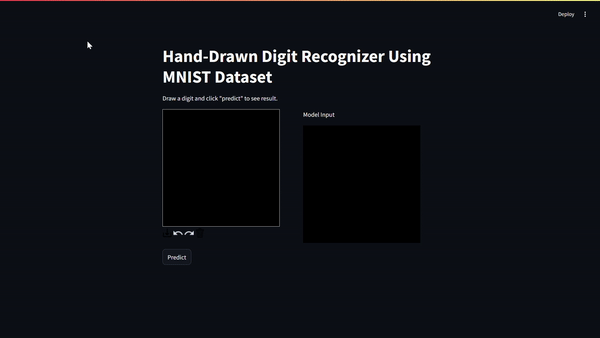

# Digit Recognizer Neural Network

Project Setup Instructions:

Step 1: Set Up a New Environment

First, create a new virtual environment by running the following command in your terminal:

`python -m venv .venv`

Step 2: Activate Your Environment
Activate your virtual environment using the appropriate command for your operating system:

Windows Command Prompt: `.venv\Scripts\activate.bat`

Windows PowerShell: `.venv\Scripts\Activate.ps1`

macOS and Linux: `source .venv/bin/activate`

Step 3: Install Dependencies
Install the necessary dependencies by running:

`pip install numpy pandas matplotlib streamlit opencv-python streamlit-drawable-canvas`

Step 4: Train the Model
Train the model by running:

`python digit_recognizer_NN.py`

Step 5: Run the Web UI
Launch the web UI with the following command:

`streamlit run app.py`
